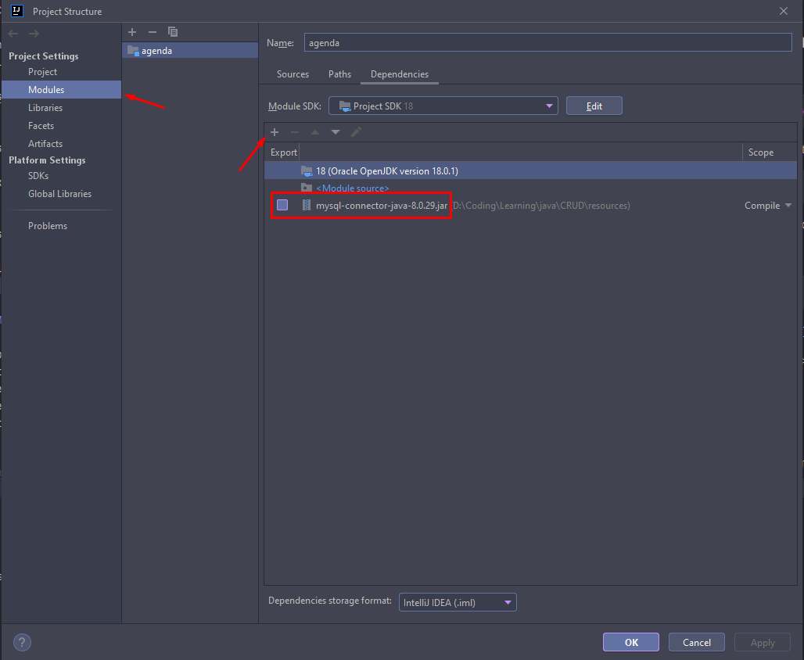

# Agenda CRUD

## 1. Objetivo

Em meus estudos de Java, imaginei como seria a realização de uma conexão com banco de dados MySQL e o quão fácil (ou não) seria fazer isto utilizando Java puro (sem frameworks como Spring).
Cheguei em uma solução que utiliza JDBC para conexão com o MySQL.

## 2. Tecnologias utilizadas

- Java
- JDBC (API)

## 3. Como executar em sua máquina?

1. Clonar o repositório em um local desejado:
>git clone https://github.com/randradee/agenda_crud.git

2. Em sua máquina, é necessário que o MySQL esteja instalado:
>https://dev.mysql.com/downloads/installer/

Siga as instruções e após a instalação, rode o servidor local.

3. Baixe o arquivo jar do connector Java/MySQL:
>https://dev.mysql.com/downloads/connector/j/

4. Na sua IDE, abra o projeto (exemplo com IntelliJ):

- Em File -> Project Structure -> Project Settings -> Modules -> Na aba de "Dependencies", adicione o jar do connector.

5. Na classe ConnectionFactory, atualize as variáveis de usuário e senha do banco de dados com o que foi cadastrado no momento de instalação do MySQL.

6. No terminal, execute o comando:
> mysql -u "usuario" -p

Substituindo usuário por seu usuário e após isto, digite a sua senha.

7. Abra o arquivo _script.sql_ que está na pasta resources e execute os comandos no terminal para gerar o banco de dados;
8. Na classe App.java, basta rodar a função main e testar!

## 4. Melhorias futuras

- Encapsulamento dos segredos de acesso do banco em variáveis de ambiente;
- Construção de uma API para eliminar a interação via terminal;
- Testes unitários;
- Testes da API com Postman;
- Construção de um frontend em React para consumir a API.